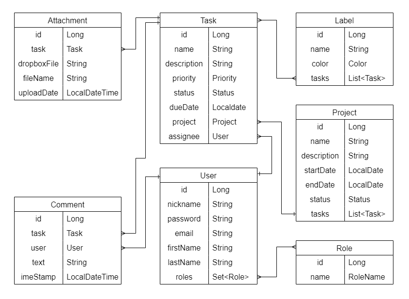

# 🧙 The all-seeing Eye System

## 📜 Project description:

One app to rule them all, 
one app to find them, 
One app to bring them all 
and in the darkness bind them. 

Each Dark Lord needs the system for effectively managing his campaign.  
The all-seeing Eye System allows you split your main campaign to different projects with own name, description, dates of starting and ending. Also, you can follow for its status.  
The base for all achievements is building your own dream-team. The email/password access closes whole structure from average people, nicknames are needed for convenient communication between groups and role model makes variable access for your team to your plans.   
For the best ruling of project flowing was applied the best strategy: divide and conquer. Creating flexible separated structure of tasks allows you to be prepared for any challenges on your way.
Each task has a set of attributes for better control. Main of those is assignee, a person-executant who would be responsible for success or fail of this job. 
The fields "status" and "dueDate" have to give some hints to assignee about his destiny, depending on the task result. But also you should remember: clear task description will bring closer you to your aims.  
Comments allow your team to help each other improve their skills and faster finished the work.  
The last system feature is using attachments: different files, that connected with a task and are stored somewhere in Palantir-cloud. It could be added by any team-mate for sharing info, ideas and approaches for solving task issues.  
And the last sweet, but only for you, is label marked system for grouping tasks by only you needed and understood criteria.  

Build plans, achieve goals and with this app whole world is at your feet!

#### The app follows a three-tier architecture by separating presentation, application, and data tiers:

* Controller: handles user interactions, including HTTP request handling and response generation;
* Service: contains the core application logic;
* Repository: interacts with the underlying data storage.

## 🔗 Entity-Relationship Diagram

## 🛠️ Project Functionality:

User can have USER or ADMIN roles. USER role is assigned automatically to each newly registered user. One default user with role ADMIN is already added to database.  
Access types: 🟢 - unregistered user 🟡 - ADMIN role 🟠 - ADMIN or USER roles
* AuthController
  * 🟢 login user;
  * 🟢 register new user;
* UserController
  * 🟠 get user info
  * 🟠 update user info
  * 🟡 update user roles
* ProjectController
  * 🟡 create new project
  * 🟠 get user's projects
  * 🟠 get project by id
  * 🟡 get tasks for project
  * 🟡 update project by id
  * 🟡 delete project by id
* TaskController
  * 🟡 create new task
  * 🟠 get task by id
  * 🟡 update task by id
  * 🟡 delete task by id
* CommentController
  * 🟠 create new comment
  * 🟠 get comments for task
* AttachmentController
  * 🟠 create new attachment
  * 🟠 get attachments
* LabelController
  * 🟡 create new label
  * 🟡 get labels
  * 🟡 update label by id
  * 🟡 delete label by id

## ⚙️ Technologies:

* JDK 17
* Maven 3.9.4
* Spring Boot Starter 3.1.2
* Spring Boot Starter Security 3.1.2
* Spring Boot Starter Data JPA 3.1.2
* PostgreSQL 16.0
* MySQL 8.0.33
* Liquibase 4.20.0
* Lombok 1.18.28
* Mapstruct 1.5.5
* JWT 0.11.5
* Docker 24.0.6

## 🗃️ Project structure:

#### [intro/src/main/java/mate/intro](src/main/java/mate/intro)
* [config](src/main/java/mate/intro/config) - configuration classes for mapper and security
* [controller](src/main/java/mate/intro/controller) - http controllers
* [dto](src/main/java/mate/intro/dto) - classes for providing information in http requests and responses
* [exception](src/main/java/mate/intro/exception) - global exception handler and custom exceptions
* [mapper](src/main/java/mate/intro/mapper) - classes for map entities
* [model](src/main/java/mate/intro/model) - entity classes used in the application
* [repository](src/main/java/mate/intro/repository) - classes for CRUD operation with database
* [security](src/main/java/mate/intro/security) - classes for provide security
* [service](src/main/java/mate/intro/service) - classes that provide business logic

#### [resources/](src/main/resources)
* [changelog](src/main/resources) - files for manage database with liquibase
* [application.properties](src/main/resources) - contains application configuration
* [liquibase.properties](src/main/resources) - contains liquibase properties

#### [intro/src/test/java/mate/intro](src/test/java/mate/intro)
* [config](src/test/java/mate/intro/config) - configuration class for test user
* [controller](src/test/java/mate/intro/controller) - test classes for controllers
* [repository](src/test/java/mate/intro/repository) - test classes for repositories
* [service](src/test/java/mate/intro/service) - test classes for services

#### [intro/src/test/resources](src/test/resources)
* [database](src/test/resources/database) - folder with SQL scripts for testing controllers
* [application.properties](src/test/resources/application.properties) - contains testing app properties 

#### other files
* [pom.xml](pom.xml) - contains maven configuration
* [checkstyle.xml](checkstyle.xml) - contains checkstyle rules
* [Dockerfile](Dockerfile) - configuration for docker
* [docker-compose.yml](docker-compose.yaml) - this file is used with Docker Compose to define multi-container applications. It specifies the services, networks, and volumes required for running the application, along with any environment variables.

## 🕹️ How to run the project locally:
* Ensure you have Docker installed on your system.
* Configure your database settings in the .env file.
* Open a terminal and navigate to the root directory of your project.
* Run the application using Docker Compose: docker-compose up
* Explore the endpoints using tools like Postman or Swagger
